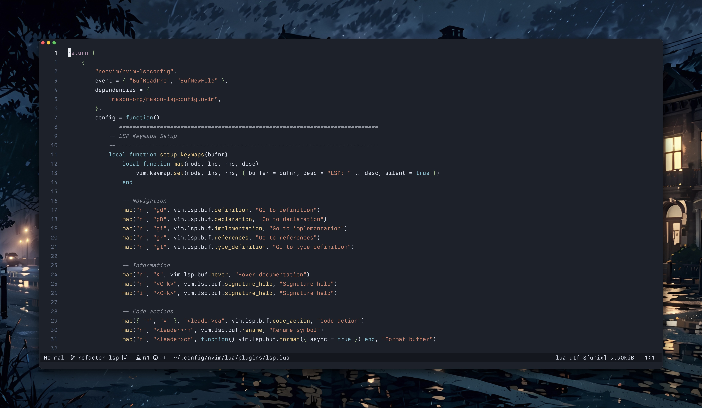

# Pinnord for Neovim

Neovim color scheme based on the VSCode theme inspired by [Nord](https://marketplace.visualstudio.com/items?itemName=arcticicestudio.nord-visual-studio-code) and [Nord Deep](https://marketplace.visualstudio.com/items?itemName=marlosirapuan.nord-deep).

## Preview




## Installation

### Using a plugin manager

#### Packer
```lua
use {
  'adibhanna/pinnord.nvim',
  config = function()
    vim.cmd([[colorscheme pinnord]])
  end
}
```

#### Lazy.nvim
```lua
{
  'adibhanna/pinnord.nvim',
  priority = 1000,
  config = function()
    vim.cmd([[colorscheme pinnord]])
  end,
}
```

#### vim-plug
```vim
Plug 'adibhanna/pinnord.nvim'
colorscheme pinnord
```

### Manual installation

1. Copy `colors/pinnord.lua` to your Neovim colors directory:
   ```bash
   mkdir -p ~/.config/nvim/colors
   cp neovim/colors/pinnord.lua ~/.config/nvim/colors/pinnord.lua
   ```

2. Add to your `init.lua` or `init.vim`:
   ```lua
   vim.cmd('colorscheme pinnord')
   ```
   or
   ```vim
   colorscheme pinnord
   ```

## Features

- Full support for Treesitter syntax highlighting
- LSP semantic tokens support
- Comprehensive highlight groups for popular plugins:
  - NvimTree
  - Telescope
  - WhichKey
  - Cmp (nvim-cmp)
  - Gitsigns
  - Bufferline
  - Noice
  - Mini plugins
  - Snacks.nvim (pickers, notifier, zen mode, scratch buffers, and more)
  - And more
- Terminal colors support
- Proper diff highlighting
- Diagnostic highlights for errors, warnings, info, and hints

## Color Palette

- **Background**: `#1C212A` (main), `#14171d` (panels)
- **Foreground**: `#d8dee9` (default), `#eceff4` (active)
- **Cyan**: `#88c0d0` (keywords, accents)
- **Blue**: `#81a1c1` (info, links)
- **Green**: `#a3be8c` (types, classes)
- **Yellow**: `#ebcb8b` (numbers, functions, warnings)
- **Orange**: `#d08770` (strings)
- **Red**: `#bf616a` (errors)
- **Purple**: `#b48ead` (control keywords)

## Ghostty Terminal Theme

A matching Ghostty terminal theme is included in this repository. The theme file `Pinnord` provides a consistent color experience across Neovim and Ghostty terminal.

### Installation

Copy the contents of the `Pinnord` file and save it as a theme file in your Ghostty config themes directory (`~/.config/ghostty/themes/`), then set `theme = <filename>` in your Ghostty config.

The Ghostty theme includes:
- 16-color ANSI palette matching the Neovim colorscheme
- Background and foreground colors
- Cursor and selection colors
- All colors synchronized with the Neovim theme

## Requirements

- Neovim 0.5+ (for Lua support)
- `termguicolors` enabled (recommended)

Add this to your config if not already set:
```lua
vim.o.termguicolors = true
```

